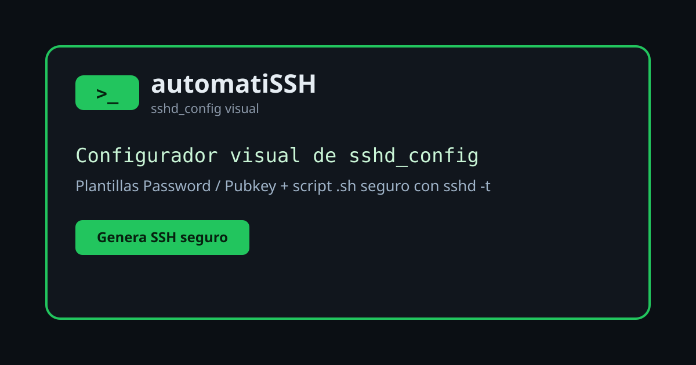

# automatiSSH-server

Configurador visual de `sshd_config`: elige directivas de OpenSSH con una interfaz web y genera un script `automatiSSH-server.sh` listo para aplicar en tu servidor.

Todo funciona 100% en el navegador (HTML + CSS + JS). Tus ajustes se guardan en `localStorage`.

**Demo:** https://akamto.github.io/automatiSSH-server/

## Uso

1. Abre `index.html` en el navegador.
2. Marca los checks de las directivas que quieras incluir y ajusta sus valores (103 directivas disponibles, con buscador y descripciones).
3. Usa las plantillas **PasswordAuthentication** / **PubkeyAuthentication** como punto de partida.
4. Revisa las pestañas del panel derecho:
   - `sshd_config`: cómo quedará el archivo tras aplicar el script.
   - `automatiSSH-server.sh`: el script a descargar.
   - `PasswordAuthentication` / `PubkeyAuthentication`: pasos para ejecutar el script y conectarte.
5. Descarga el `.sh`, súbelo al servidor y ejecútalo con `sudo`.

## Qué hace el script generado

1. Actualiza e instala `openssh-server` (`apt`).
2. Escribe tus directivas en `/etc/ssh/sshd_config.new`.
3. Valida con `sshd -t -f /etc/ssh/sshd_config.new` (si falla, no toca nada y lo verás en `/var/log/automatiSSH-server.log`).
4. Solo si valida: backup a `/etc/ssh/sshd_config.bak` y sustituye `/etc/ssh/sshd_config`.
5. Recarga los servicios `ssh` / `sshd` / `ssh.socket`.

> **Seguridad**: revisa siempre el archivo generado antes de aplicarlo. Un `Port` o `PasswordAuthentication` mal configurado puede dejarte fuera del servidor: mantén una sesión SSH abierta mientras aplicas cambios y verifica con `sshd -t`.

## Licencia

MIT — ver [LICENSE](LICENSE).
